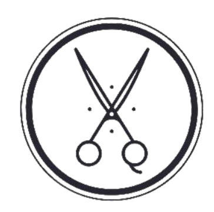

<h1 align="center">
  
  
Kgest

</h1>

<h3 align="center">  
  Sistema de gestão para barbearias
  

  

    
    
    
    
  

</h3>

# 🚀 Projeto

Este projeto teve como objetivo principalmente o aprendizado no desenvolvimento com ReactJS e também sanar a necessidade gestorial de barbearias 

<h4> 
	🚧  Kgest 🚀 Concluido  🚧
</h4>

Demo - [Aqui](https://kgestdemo.web.app)

Usuario: user

senha: 123

# 🛠 Tecnologias

- [ReactJS](https://pt-br.reactjs.org/)
- [React-router-dom](https://github.com/remix-run/react-router)
- [Styled-components](https://styled-components.com/)
- [Material-UI](https://material-ui.com/)
- [SupaBase](https://supabase.io/)
- [FireBase](https://firebase.google.com/)
- [VS Code](https://code.visualstudio.com/) with  [ESLint](https://marketplace.visualstudio.com/items?itemName=dbaeumer.vscode-eslint)

# 📝 License

This project is under the MIT license. See the [LICENSE](https://github.com/kreittus/Kgest/blob/main/LICENSE) for more information.
